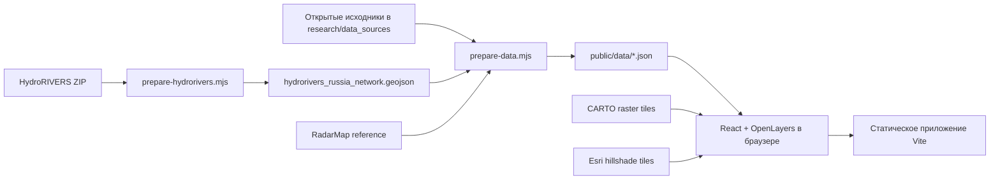

# База знаний проекта Radar Russia Map

> **Документ описывает состояние на 26 июля 2026 года и устарел частично.**
> Разделы про геоданные, слои карты и подготовку справочников по-прежнему
> верны — это самая подробная их запись. Но статус «статический прототип»,
> оценки готовности и разделы про производительность относятся ко времени
> до появления конвейера событий, боевого сервера и SEO.
> Актуальное введение: `docs/AI_HANDOFF.md`.

Статус документа: подробный справочник по геоданным и карте.  
Последняя сверка с кодом и данными: 26 июля 2026 года.  
Рабочая директория: `/Users/rub1kub/Documents/Radar`.

## 1. Назначение документа

Этот документ отвечает на пять вопросов:

1. Что именно представляет собой продукт сейчас.
2. Как устроены карта, интерфейс и подготовка геоданных.
3. Откуда взяты данные, какие у них лицензии и ограничения.
4. Какие решения уже приняты и почему карта ведет себя именно так.
5. Что обязательно исправить до production.

При расхождении документа с реализацией приоритет источников истины такой:

1. Исполняемый код в `src/` и `scripts/`.
2. Фактические сгенерированные данные и `public/data/summary.json`.
3. Этот документ.
4. `research/README.md`, который является исследовательским журналом на дату сбора.
5. История обсуждений и скриншоты.

## 2. Краткий статус

Проект сейчас является статическим картографическим прототипом:

- React отображает интерфейс.
- OpenLayers рендерит растровую подложку и клиентские векторные слои.
- Vite собирает и раздает приложение.
- Геоданные заранее преобразуются Node.js-скриптами в JSON.
- Backend, база данных, собственный tile server и live-события отсутствуют.

Реализовано:

- 89 полигонов регионального уровня в принятой продуктом конфигурации;
- 2 327 полигонов ADM2 из набора geoBoundaries для RUS;
- 209 789 точек населенных пунктов из GeoNames RU и дополнительной выборки UA;
- русификация регионов, районов и части населенных пунктов;
- поиск регионов, районов и населенных пунктов;
- выбор региона, района или населенного пункта с приоритетом по масштабу;
- обзорные городские полигоны, дороги и железные дороги;
- Крымский мост как вручную добавленная линейная геометрия;
- подложка CARTO без подписей и отдельный hillshade Esri;
- опциональные водоемы, реки, лесные/тундровые/болотные зоны;
- адаптивная компоновка для desktop, tablet и mobile.

Не реализовано:

- production API и БД;
- векторные тайлы и серверная генерализация;
- полная улично-дорожная сеть;
- полные контуры всех населенных пунктов;
- административная иерархия `регион -> район -> населенный пункт`;
- официальная нормализация по ОКТМО/ФИАС;
- гарантированно русские названия всех 209 789 населенных пунктов;
- районы для шести добавленных региональных полигонов;
- live-оповещения, история, аналитика или учетные записи;
- тесты, линтер, CI/CD, мониторинг и production deployment;
- полный юридический пакет по лицензиям и атрибуции.

Итог: карту можно использовать для визуального прототипирования. Публиковать ее как
полный и надежный production-справочник пока нельзя.

## 3. Продуктовый замысел

Целевой продукт — интерактивная карта с привычной картографической иерархией:

- на дальнем масштабе читаются страна, регионы и крупнейшие города;
- на среднем — районы, основные дороги, железные дороги, реки и города;
- на ближнем — населенные пункты, городские силуэты и локальная инфраструктура;
- клик на дальнем масштабе выбирает регион;
- клик на ближнем масштабе выбирает район;
- населенный пункт выбирается только при достаточно близком масштабе;
- все пользовательские административные названия должны быть на русском;
- подписи не должны превращать карту в плотное текстовое полотно;
- города не должны изображаться яркими точками;
- рельеф не должен дублироваться цветным пользовательским слоем поверх готовой карты;
- дороги и железные дороги должны быть различимы, но визуально тише границ и подписей;
- интерфейс должен показывать сам продукт, а не исследовательские заметки, счетчики
  наборов данных или объяснения реализации.

Визуальный ориентир — спокойная иерархия Google Maps, Яндекс Карт, 2ГИС, Apple Maps
и RadarMap, а не буквальное копирование конкретного провайдера.

## 4. Термины

| Термин | Значение в проекте |
|---|---|
| Регион | Полигон уровня ADM1 / субъектовая единица карты |
| Район | Полигон уровня ADM2 из geoBoundaries; фактически может быть районом, округом или муниципалитетом |
| Населенный пункт | Любой объект GeoNames feature class `P`, а не только город |
| Городской контур | Обзорный полигон `Urban area` из Natural Earth |
| Подложка | Растровые тайлы CARTO Voyager без подписей |
| Hillshade | Растровая отмывка рельефа Esri |
| Именная река | 188 подписываемых линий Natural Earth |
| Речная сеть | Детальные безымянные сегменты HydroRIVERS |
| Supplemental-регион | Один из шести вручную добавленных полигонов из Natural Earth |
| RadarMap reference | Сохраненные материалы radar-map.ru только для анализа |
| ETL | Скрипты, которые читают исходники и создают `public/data/*.json` |

## 5. Репозиторий

### 5.1. Состояние Git

- Git-репозиторий инициализирован.
- Текущая ветка: `main`.
- Коммитов нет.
- Все файлы рабочей копии сейчас untracked.

Это блокер для командной и production-разработки: нет базовой ревизии, истории
изменений, воспроизводимого review и безопасного отката.

### 5.2. Размеры

Срез на 26 июля 2026 года:

| Каталог | Размер |
|---|---:|
| Вся рабочая копия | около 2,0 ГБ |
| `research/` | около 596 МБ |
| `public/` | около 112 МБ |
| `node_modules/` | около 132 МБ |
| `dist/` | около 113 МБ |
| `src/` | около 68 КБ |
| `scripts/` | около 60 КБ |

Большие архивы нельзя без решения автоматически складывать в обычный Git.
Нужен Git LFS, объектное хранилище или отдельный воспроизводимый downloader.

### 5.3. Структура

```text
.
├── README.md
├── docs/
│   └── PROJECT_KNOWLEDGE_BASE.md
├── src/
│   ├── App.tsx
│   ├── main.tsx
│   ├── styles.css
│   └── vite-env.d.ts
├── scripts/
│   ├── prepare-data.mjs
│   ├── prepare-hydrorivers.mjs
│   └── shapefile.mjs
├── public/
│   └── data/
├── research/
│   ├── README.md
│   ├── data_sources/
│   ├── radarmap_assets/
│   ├── radarmap_reference/
│   └── source_inventory.tsv
├── package.json
├── package-lock.json
├── vite.config.ts
└── tsconfig*.json
```

### 5.4. Ответственность файлов

| Файл | Ответственность |
|---|---|
| `src/App.tsx` | Все runtime-состояние, карта, слои, стили OpenLayers, поиск и выбор |
| `src/styles.css` | Компоновка, sidebar, details panel, легенда, responsive |
| `src/main.tsx` | React entry point и StrictMode |
| `scripts/prepare-data.mjs` | Основной ETL всех опубликованных наборов |
| `scripts/prepare-hydrorivers.mjs` | Тяжелая отдельная подготовка HydroRIVERS |
| `scripts/shapefile.mjs` | Минимальный встроенный SHP/DBF parser |
| `public/data/*` | Генерируемый runtime-контент браузера |
| `research/data_sources/*` | Исходные открытые наборы и архивы |
| `research/radarmap_reference/*` | Снимки структур RadarMap для анализа |
| `research/radarmap_assets/*` | Скачанные иконки RadarMap, не для публикации |

## 6. Технологический стек

Версии в `package-lock.json`:

| Компонент | Версия |
|---|---:|
| Node.js в текущей среде | 22.16.0 |
| npm в текущей среде | 10.9.2 |
| React | 18.3.1 |
| React DOM | 18.3.1 |
| OpenLayers (`ol`) | 10.9.0 |
| lucide-react | 0.468.0 |
| TypeScript | 5.9.3 |
| Vite | 8.0.16 |

`package.json` допускает обновления внутри major через `^`, поэтому фактическая
версия определяется lock-файлом, а не только диапазоном зависимости.

TypeScript работает в strict mode, `noEmit` включен. Отдельного линтера,
formatter-конфигурации и test runner нет.

## 7. Архитектура



### 7.1. Что выполняется на сервере

В текущем проекте серверной логики нет. Vite в development и любой статический
хостинг в production только отдают:

- HTML/CSS/JS;
- JSON из `public/data`;
- запросы к внешним tile providers браузер делает напрямую.

### 7.2. Что выполняется в браузере

Браузер:

1. Загружает `regions.json`, `districts.json` и `places.json` параллельно.
2. Парсит GeoJSON регионов и районов в EPSG:3857.
3. Создает отдельный OpenLayers `Feature` для каждой строки населенного пункта.
4. Строит кластерный источник для всех населенных пунктов.
5. Строит поисковый каталог для всех регионов, районов и населенных пунктов.
6. Создает растровые и векторные слои.
7. Подгружает остальные JSON только при включенном слое и нужном масштабе.

Это объясняет текущие лаги: основной поток сразу обрабатывает более 212 тысяч
объектов и около 41 МБ несжатого JSON еще до работы тяжелых дополнительных слоев.

## 8. Runtime карты

### 8.1. Проекция и стартовый вид

- Исходные данные: EPSG:4326.
- Runtime-проекция OpenLayers: EPSG:3857.
- Центр обзора: `[96, 63]`.
- Desktop zoom: `2.35`.
- Mobile zoom: `1.9`.
- Минимальный zoom: `1.75`.
- Максимальный zoom: `9.8`.
- Mobile breakpoint для стартового вида: `760px`.

Максимальный zoom `9.8` недостаточен для детальной городской или уличной карты.

### 8.2. Внешние тайлы

Значения по умолчанию:

```text
Basemap:
https://{a-d}.basemaps.cartocdn.com/rastertiles/voyager_nolabels/{z}/{x}/{y}.png

Hillshade:
https://services.arcgisonline.com/ArcGIS/rest/services/Elevation/World_Hillshade/MapServer/tile/{z}/{y}/{x}
```

Подложка имеет opacity `0.9`, hillshade — `0.24`. Hillshade включается и
выключается вместе с флагом «Готовая карта». Отдельного пользовательского
переключателя рельефа нет.

Поддерживаемые build-time переменные:

```text
VITE_BASEMAP_URL
VITE_BASEMAP_ATTRIBUTION
VITE_HILLSHADE_URL
VITE_HILLSHADE_ATTRIBUTION
```

Переменные Vite попадают в клиентский bundle. В них нельзя хранить секреты.

### 8.3. Слои

| z-index | Слой | По умолчанию | Источник | Условие загрузки/показа |
|---:|---|---|---|---|
| 0 | CARTO basemap | включен | внешний XYZ | сразу |
| 1 | Esri hillshade | включен вместе с basemap | внешний XYZ | сразу |
| 2 | Леса и болота | выключен | `land-cover.json` | по включению |
| 5 | Водоемы | выключен | `water-bodies.json` | по включению |
| 6 | Крупная речная сеть | выключен | `river-network-major.json` | слой рек + zoom `>= 4.8` |
| 7 | Детальная речная сеть | выключен | `river-network-detail.json` | слой рек + zoom `>= 7.6` |
| 8 | Именные реки | выключен | `rivers.json` | по включению, layer minZoom `2.6` |
| 26 | Городские контуры | включен | `urban-areas.json` | zoom `>= 4.3` |
| 20 | Районы | включен | `districts.json` | сразу, layer minZoom `4.15` |
| 23 | Железные дороги | включен | `railways.json` | zoom `>= 4.8` |
| 24 | Дороги | включен | `roads.json` | zoom `>= 4.65` |
| 28 | Регионы | включен | `regions.json` | сразу |
| 30 | Кластерный слой мест | включен | `places.json` | сразу, layer minZoom `2.15` |
| 31 | Declutter-подписи мест | включен | `places.json` | сразу, layer minZoom `2.15` |

После первой загрузки ленивый слой остается в памяти. Выключение checkbox скрывает
его, но не освобождает features.

### 8.4. Визуальная иерархия

- Регионы имеют почти прозрачную заливку и двойную границу: светлый halo и
  приглушенную внутреннюю линию.
- Районы имеют очень слабую заливку и тонкую линию.
- Выбранный объект подсвечивается теплым желтым оттенком.
- Основные дороги рисуются золотистыми двойными линиями без черной обводки.
- Второстепенные дороги тоньше и появляются позже.
- Железные дороги — тонкая темная линия со светлым редким пунктиром.
- Городские контуры — приглушенная серо-зеленая заливка.
- Населенные пункты рисуются текстом без яркой точки.
- Подписи используют светлый halo для читаемости на готовой подложке.

### 8.5. Правила выбора

Константы:

```text
DISTRICT_SELECTION_ZOOM = 5.4
PLACE_SELECTION_ZOOM = 7.2
```

Алгоритм клика:

1. OpenLayers собирает все попавшие под pixel features регионов, районов и мест.
2. При zoom `>= 7.2` кластер из нескольких мест приближает карту до `maxZoom 8.4`.
3. При zoom `>= 7.2` одиночное место выбирается как населенный пункт.
4. При zoom `>= 5.4` выбирается район, а при его отсутствии регион.
5. При zoom `< 5.4` выбирается регион, а при его отсутствии район.

Следствие: в supplemental-регионах, для которых нет ADM2, близкий клик все равно
выбирает регион.

Hit tolerance:

- pointer cursor: 5 px;
- click selection: 8 px.

### 8.6. Кластеризация и подписи населенных пунктов

Кластеризация:

- distance: 22 px;
- minDistance: 4 px.

Приоритет места внутри кластера:

- население;
- бонус `20 000 000` для `PPLC`;
- бонус `5 000 000` для `PPLA`;
- бонус `1 000 000` для `PPLA2`;
- штраф `750 000` для `PPLX`.

Порог появления подписи:

| Категория | Минимальный zoom |
|---|---:|
| Население `>= 1 000 000` | 2.2 |
| `>= 700 000` | 3.1 |
| `>= 300 000` | 4.1 |
| `>= 100 000` | 5.2 |
| Административный центр `>= 50 000` | 6.1 |
| `>= 20 000` | 7.2 |
| `>= 5 000` | 8.4 |
| Меньше 5 000 | 10.4 |
| `PPLX` | не раньше 9.5 |

Критический нюанс: карта ограничена zoom `9.8`, поэтому 206 734 места с
населением меньше 5 000 или без населения никогда не получают обычную
автоматическую подпись. Их можно найти поиском и выбрать, но «все поселки видны
на карте» текущая реализация не обеспечивает.

Отдельный declutter-слой содержит только места с населением `>= 20 000`: 985
features.

### 8.7. Поиск

- Запрос начинает работать с двух символов.
- Используется lowercase substring match.
- Проверяются русское имя, `asciiName`, тип места и ISO для административных объектов.
- Максимум подсказок: 10.
- Каталог упорядочен: регионы, затем места, затем районы.
- Выбор региона fit-ит геометрию с maxZoom `5.2`.
- Выбор района — с maxZoom `7.4`.
- Выбор места анимирует карту минимум до zoom `8.8`.

Ограничения:

- Поиск линейно фильтрует более 212 тысяч записей на каждый запрос.
- Нет индексирования, токенизации, fuzzy search, нормализации `е/ё`.
- Одинаковые названия не различаются родительским регионом/районом.
- Subtitle места показывает только тип, а не регион.
- Нет keyboard navigation и явной обработки `Enter`/стрелок.

### 8.8. Панели и responsive

Desktop:

- topbar: 64 px;
- колонки: `320px / карта / 320px`;
- body не прокручивается, панели прокручиваются независимо.

До `980px`:

- sidebar: 280 px;
- details panel переезжает вниз на всю ширину;
- максимальная высота details: 230 px.

До `760px`:

- одна колонка;
- порядок: карта, управление, details;
- карта: `62vh`, но не меньше 520 px;
- body получает вертикальный scroll.

Zoom-кнопки OpenLayers отключены. Управление масштабом остается колесом мыши,
pinch-жестом и кнопкой сброса вида.

### 8.9. Доступность

Есть:

- semantic `header`, `main`, `aside`, `section`;
- aria-label у панелей и карты;
- реальные checkbox и button;
- связанный label для поиска;
- декоративные иконки скрыты через `aria-hidden`.

Не хватает:

- полноценного combobox/listbox keyboard behavior;
- фокусного управления после выбора подсказки;
- keyboard-доступа к canvas-объектам;
- объявлений об изменении details;
- проверки контрастности и screen-reader сценариев.

## 9. Пайплайн данных

### 9.1. Главный принцип

`public/data` — производный артефакт. Все постоянные исправления делаются в:

- исходных файлах `research/data_sources`;
- нормализаторах и overrides в `scripts/prepare-data.mjs`;
- отдельном HydroRIVERS ETL.

Ручное изменение `public/data/*.json` будет потеряно.

При каждом запуске `prepare:data`:

- создается `public/data`, если его нет;
- удаляется устаревший `public/data/cities.json`;
- рекурсивно удаляется `public/icons`;
- перезаписываются все поддерживаемые JSON;
- в одноразовой SQLite запускается геометрическое сопоставление ОКТМО;
- районам дописываются каноническое имя, `zone` и родительский `region`, при
  этом уже опубликованный zone ID сохраняется независимо от нового написания;
- обновляется `summary.json.generatedAt`.

`public/icons` нельзя использовать для постоянных ассетов без изменения ETL.

### 9.2. Источники

| Источник | Текущее применение | Лицензия по локальным материалам | Production-нюанс |
|---|---|---|---|
| geoBoundaries RUS ADM1/ADM2 | 83 региона и 2 327 районов | ODbL 1.0 в metadata конкретных файлов | границы 2017 года, нужны attribution/share-alike и актуализация |
| Natural Earth 1:10m | supplemental-регионы, вода, реки, urban, дороги, ЖД, terrain, glaciers | public domain | обзорная точность, не локальная карта |
| HydroSHEDS HydroRIVERS v1.0 | детальная речная сеть | использование разрешено с соблюдением terms/citation | не все линии имеют имена, нужна атрибуция |
| RESOLVE Ecoregions 2017 | лес/тайга, тундра, flooded/wetland-like зоны | CC BY 4.0 | это биомы, не лесные кварталы и не реестр болот |
| GeoNames RU | все населенные пункты и словарь русификации | CC BY 4.0 | много пустого населения, дублей и латиницы |
| GeoNames UA | места выбранных admin1-кодов | CC BY 4.0 | применяется собственная русификация, нужна верификация |
| Росстат ОКТМО | канонические имена и геометрическая проверка районов/НП | официальные открытые данные; условия проверить перед публикацией | привязка хранится через стабильные source ID и алиасы зон |
| Geofabrik/OSM sample | только исследование | ODbL | production-кандидат, но текущий pipeline его не использует |
| RadarMap reference | имена регионов и preferred names части мест; UX/schema reference | публичная лицензия не найдена | текущее использование противоречит статусу reference-only |
| CARTO | runtime basemap | условия провайдера | нужен production-тариф/SLA или собственные тайлы |
| Esri | runtime hillshade | условия провайдера | нужен production-тариф/SLA или собственный hillshade |

Лицензионная оценка в этом документе техническая, не юридическая.

### 9.3. Версии и свежесть исходников

- geoBoundaries metadata: boundary year 2017, source update 2023, build 12.12.2023.
- Natural Earth: масштаб 1:10m; точный release в проекте не зафиксирован.
- HydroRIVERS: v1.0.
- RESOLVE: Ecoregions 2017.
- Росстат: файл данных `20260601T1406`, структура `20260210T1102`.
- GeoNames: дата скачивания dump отдельно не записана.
- RadarMap reference: скачан 16.06.2026.

Отсутствие точных source version, download timestamp и полных SHA-256 в одном
машиночитаемом manifest является production-риском.

### 9.4. Сгенерированные наборы

Срез после `prepare:data` 09.08.2026:

| Файл | Объекты | Raw | Gzip локальной оценки | Загружается |
|---|---:|---:|---:|---|
| `regions.json` | 90 | 5.35 MiB | 1.39 MiB | сразу |
| `districts.json` | 2 416 | 14.66 MiB | 3.86 MiB | сразу |
| `places.json` | 209 789 | 21.48 MiB | 4.05 MiB | сразу |
| `water-bodies.json` | 222 | 0.36 MiB | 0.10 MiB | по включению |
| `rivers.json` | 188 | 0.77 MiB | 0.23 MiB | по включению |
| `river-network-major.json` | 7 180 групп | 27.88 MiB | 5.48 MiB | zoom `>= 4.8` |
| `river-network-detail.json` | 12 364 групп | 31.81 MiB | 6.18 MiB | zoom `>= 7.6` |
| `land-cover.json` | 45 | 2.28 MiB | 0.66 MiB | по включению |
| `terrain-regions.json` | 46 | 0.09 MiB | 0.03 MiB | не используется клиентом |
| `glaciers.json` | 85 | 0.13 MiB | 0.04 MiB | не используется клиентом |
| `urban-areas.json` | 1 241 | 1.97 MiB | 0.16 MiB | zoom `>= 4.3` |
| `roads.json` | 4 652 | 2.05 MiB | 0.36 MiB | zoom `>= 4.65` |
| `railways.json` | 6 151 | 4.07 MiB | 0.79 MiB | zoom `>= 4.8` |

Development Vite отдает JSON без compression и с `Cache-Control: no-cache`.
Production-хостинг обязан включить Brotli/Gzip, immutable caching для
версионированных файлов и корректную инвалидацию.

### 9.5. Схема регионов

```ts
type RegionProperties = {
  id: string;
  name: string;
  iso: string | null;
  zone: string;
  kind?: "sea";
};
```

Геометрия: `Polygon` или `MultiPolygon`, координаты округлены до 3 знаков.

Состав:

- 83 объекта geoBoundaries;
- 6 supplemental-объектов Natural Earth:
  - Республика Крым;
  - Севастополь;
  - Донецкая Народная Республика;
  - Луганская Народная Республика;
  - Запорожская область;
  - Херсонская область.
- отдельная региональная зона `Азовское море` с `kind = "sea"`, которая не
  используется как родитель сухопутных районов.

У шести supplemental-объектов `iso = null`. Их IDs начинаются с `supplemental-`.
Natural Earth source codes остаются только в исходном supplemental-файле и не
публикуются в `regions.json`.

Текущая политика имен и границ является продуктовой конфигурацией. До выхода на
рынки необходимо явно утвердить юридическую и отображательную policy.

### 9.6. Схема районов

```ts
type DistrictProperties = {
  id: string;
  name: string;
  iso: string | null;
  zone: string;
  region: string;
};
```

Нюансы:

- 2 327 объектов получены из geoBoundaries RUS ADM2;
- ещё 89 полигонов выбранных территорий — из UKR ADM2 с полным закреплённым
  словарём русских названий;
- все `iso` сейчас `null`;
- `region` хранит ID родительского полигона, `zone` — стабильный ID зоны;
- одноимённые районы различаются по родительскому региону в БД, поиске и details;
- после сборки все 2 416 районов имеют родителя и зону.

### 9.7. Схема населенных пунктов

Для экономии размера используется массив строк:

```ts
type PlaceRow = [
  id: string,
  name: string,
  asciiName: string,
  lat: number,
  lon: number,
  population: number | null,
  featureCode: string,
  typeLabel: string
];
```

Весь набор:

- 209 789 строк;
- 200 812 строк без известного населения;
- отображаемые имена не содержат латинских, украинских или иных
  некириллических букв; `asciiName` остаётся отдельным поисковым полем;
- 22 177 названий повторяются;
- 931 дополнительная строка совпадает с другой по округленным координатам;
- duplicate GeoNames IDs не обнаружены.

Feature code distribution:

| Code | Количество | Значение в UI |
|---|---:|---|
| `PPL` | 192 914 | Населенный пункт |
| `PPLQ` | 10 739 | Населенный пункт |
| `PPLX` | 3 273 | Район / часть города |
| `PPLA2` | 1 862 | Административный центр |
| `PPLA3` | 354 | Административный центр |
| `PPLH` | 310 | Населенный пункт |
| `PPLS` | 145 | Населенный пункт |
| `PPLA` | 85 | Административный центр |
| `PPLC` | 1 | Столица |

В runtime нет `regionId`, `districtId`, ОКТМО или ФИАС ID. Только GeoNames ID и
координаты.

### 9.8. Русификация

Регионы:

- `shapeISO` geoBoundaries сопоставляется с `name_ru` из сохраненного
  `radarmap_reference/data/russia_regions.geojson`;
- supplemental-объекты уже имеют заданные русские имена.

Районы:

1. Полигон геометрически привязывается к одному из 89 субъектов.
2. `official-district-names.mjs` ищет имя только в соответствующей территории
   ОКТМО; `shapeName` сильнее глобального GeoNames lookup.
3. Сохраняются корректные `ё`, `ЗАТО`, `улус`, `кожуун`; обрезанные строки и
   ошибочные соседние объекты заменяются полным именем.
4. Все 89 используемых supplemental ADM2 имеют exact mapping русских имён.
5. `finalize_map_names.py` повторно опознаёт муниципалитет по геометрии и
   составу НП в одноразовой БД и дописывает иерархию.
6. Data QA запрещает некириллические буквы, украинские символы, машинные
   транслитерации и обрезанные типы.

Населенные пункты RU:

- исходное кириллическое имя имеет приоритет;
- иначе выбирается ближайшая русская alternate name;
- 846 крупных ориентиров из RadarMap reference используются только как
  кандидаты, а не как безусловный источник истины;
- `official-place-names.mjs` сопоставляет GeoNames admin1 с кодом субъекта
  ОКТМО по уникальным названиям населенных пунктов;
- написание-кандидат принимается из ОКТМО только в своем субъекте и только
  когда соответствует ASCII-имени GeoNames не хуже уже выбранного варианта;
- GeoNames `alternateNamesV2` от 2026-08-09 отфильтрован до 5 896 актуальных
  русских строк нужных ID; preferred-вариант принимается только после
  подтверждения ОКТМО в том же субъекте;
- текущая сборка исправляет таким образом 1 479 имен, включая `Илский` ->
  `Ильский`, `Подолск` -> `Подольск`, `Архангелск` -> `Архангельск`.

Населенные пункты supplemental:

- читается GeoNames UA для admin1-кодов `05`, `08`, `11`, `14`, `20`, `26`;
- применяются exact overrides для крупных названий;
- украинские буквы и типичные окончания преобразуются собственными правилами;
- итог сверяется с ОКТМО ДНР, ЛНР, Запорожской и Херсонской областей, Крыма
  и Севастополя; перед сравнением реестровые имена проходят ту же русскую
  нормализацию (`Лиманець` не возвращается в runtime);
- в крайнем случае используется транслитерация.

Всего массовая канонизация исправляет 1 479 имен. Ещё 24 русских названия
крупных городских частей (например, `Правый Берег`, `Киевский`,
`Каменнобродский`) закреплены по GeoNames ID: такие объекты `PPLX` не входят в
ОКТМО как самостоятельные НП. Исторические alternate names автоматически не
принимаются. Итого относительно старой сборки исправлено 1 503 отображаемых
имени. Один
канонический каталог используется картой, поиском, API и SEO. При выкладке
регионы, районы и НП синхронизируются по `source_id`; zone ID и события не
пересоздаются, прежнее написание остаётся алиасом.

### 9.9. Городские контуры

`urban-areas.json` строится из Natural Earth `ne_10m_urban_areas`.

- Это 1 241 обзорный полигон.
- Контуры не имеют опубликованного имени.
- Они не связаны с Place IDs.
- Min zoom вычисляется по площади.
- Малые города и поселки обычно не имеют такого полигона.
- Геометрия не является границей городской застройки уровня OSM.

Следовательно, текущий слой не выполняет требование «силуэты всех городов».

### 9.10. Дороги

Источник: Natural Earth `ne_10m_roads`.

Фильтрация:

- bounding box должен касаться области карты;
- длина должна быть не меньше 5 км;
- feature должен пересекать или содержать часть области карты.

Сохраняются:

- name/label;
- тип и level;
- scalerank;
- длина;
- expressway;
- minZoom и minLabel.

Это обзорная межрегиональная сеть. Улицы, большинство местных дорог, развязки и
точные городские трассы отсутствуют.

Крымский мост добавляется вручную после Natural Earth:

- ID `road-crimean-bridge`;
- LineString из 7 точек;
- заявленная длина 19 км;
- `synthetic: true`;
- minZoom `4.2`, minLabel `5.4`.

Это приблизительная визуальная геометрия, а не инженерная ось объекта.

### 9.11. Железные дороги

Источник: Natural Earth `ne_10m_railroads`.

Сохраняются:

- scalerank;
- category;
- national scale;
- electric;
- multiTrack;
- minZoom.

Крупная линия определяется по scalerank, category или national scale. Основные
линии показываются с zoom `5.55`, прочие — с `7.35`.

Это обзорная сеть без станций, платформ, названий линий и городской детализации.

### 9.12. Вода и реки

Natural Earth:

- 222 водоема;
- 188 именованных river/lake centerlines;
- подписи зависят от scalerank и minLabel.

HydroRIVERS:

- три архива: Europe/Middle East, Siberia, Asia;
- отбрасываются линии с `UPLAND_SKM < 50` и `DIS_AV_CMS < 0.5`;
- принадлежность проверяется bounding box и выборкой не более примерно 24 точек
  вдоль линии;
- сегменты группируются по zoom tier, width class и географической grid cell;
- координаты округляются до 4 знаков;
- результат: 439 511 линий в 19 544 MultiLineString-группах;
- основной JSON режется на major и detail по `minZoom <= 6.6`.

Hydro tiers:

| Условие | minZoom | widthClass | Cell |
|---|---:|---:|---:|
| basin `>= 25 000 km²` или flow `>= 250 m³/s` | 2.6 | 5 | 3° |
| `>= 5 000` или `>= 50` | 3.8 | 4 | 2° |
| `>= 1 000` или `>= 10` | 5.2 | 3 | 1° |
| `>= 200` или `>= 2` | 6.6 | 2 | 1° |
| остальные прошедшие minimum | 8.0 | 1 | 0.5° |

Нюанс точности: выборочная проверка точек может пропустить короткий сегмент,
который пересекает границу между проверяемыми точками.

### 9.13. Леса, болота и рельеф

`land-cover.json`:

- источник RESOLVE Ecoregions 2017;
- классификация по тексту biome/ecoregion;
- категории: `forest`, `wetland`, `tundra`;
- 45 крупных полигонов.

Это природные зоны, а не фактические леса, болота, вырубки и land use.

`terrain-regions.json` и `glaciers.json` по-прежнему генерируются, но клиент их
не загружает и не отображает. Отдельный цветной terrain overlay был убран, потому
что рельеф уже дает hillshade готовой карты.

В интерфейсе осталась устаревшая фраза «дороги, рельеф, гидрография» в topbar и
пустой details-карточке. Фактически «рельеф» означает только Esri hillshade.

### 9.14. Геометрическая фильтрация и точность

Основной ETL:

- округляет большинство координат до 3 знаков, то есть примерно до десятков или
  сотни метров в зависимости от широты;
- фильтрует линии/полигоны по bounding box и попаданию их coordinate vertices;
- дополнительно проверяет, не содержит ли feature точку границы региона.

Риски:

- линия может пересечь регион, но быть потеряна, если ни одна проверяемая вершина
  не попала внутрь;
- упрощенные ADM-геометрии не подходят для кадастровой точности;
- 0.2° padding неодинаков в километрах на разных широтах;
- геометрии разных источников могут не совпадать по берегам и границам.

### 9.15. Собственный shapefile parser

`scripts/shapefile.mjs`:

- читает `.shp` и `.dbf` напрямую из ZIP через системный `unzip`;
- поддерживает Point, Polyline и Polygon, включая Z/M variants без Z/M данных;
- не поддерживает MultiPoint и широкий набор редких shapefile случаев;
- DBF декодируется как UTF-8;
- numeric/float/logical поля преобразуются в JS-типы;
- polygon shells/holes определяются по ориентации колец.

Если источник имеет другую DBF-кодировку или нестандартную ориентацию, возможны
испорченные строки и отверстия полигонов.

## 10. RadarMap reference

### 10.1. Что подтверждено публично 26.07.2026

Публичные страницы:

- <https://radar-map.ru/>
- <https://radar-map.ru/help>
- <https://radar-map.ru/about>
- <https://radar-map.ru/api/state>

RadarMap заявляет:

- неофициальную карту на основе публичных лент;
- источники «Радар ВРВ» и Lpr 1;
- автоматический разбор текста сообщений;
- подсветку региона/района и event icons;
- polling `/api/state` как основной режим;
- WebSocket для подписчиков, а также SSE и reload fallback;
- историю за 24 часа с шагом 15 минут;
- локальное хранение настроек и bookmarks;
- CARTO/Esri варианты подложки;
- ленту, clustering, heatmap, screenshot и tracking UX.

Текущий `/api/state` на момент проверки:

- HTTP 200;
- state version 23;
- geo parser version 4;
- polling interval 8 секунд;
- feed type `telegram`;
- три source IDs: `lpr1_treugolnik`, `vrv_radar`, `locatorru`;
- asset keys дополнены `airport_closed` и `vanga`;
- cache policy: `max-age=10`, `stale-while-revalidate=60`.

Количество элементов в live state является текущим активным состоянием, а не
полным каталогом регионов/городов/районов.

### 10.2. Локальный снимок 16.06.2026

Сохранены:

- 8 иконок;
- 89 регионов;
- 1 858 районных полигонов западной части/Урала;
- 8 городских районов;
- 846 точек городов;
- sample `/api/state`;
- sample 24-hour history;
- sample threat analytics.

Архивный state sample:

- version 22;
- geo parser version 3;
- poll interval 20 секунд;
- два источника;
- region/city/district threat state;
- сообщения последних событий;
- direction arrows/flights;
- per-source merged states;
- пути к 8 ассетам.

History sample:

- окно 86 400 секунд;
- slot 900 секунд;
- 96 слотов.

Analytics sample:

- почасовые counts;
- heatmap;
- top regions;
- counts по регионам.

### 10.3. Что нельзя переносить

Публичная лицензия на RadarMap GeoJSON, UI-иконки и API data model не найдена.
Поэтому:

- иконки нельзя публиковать как наши assets без разрешения;
- GeoJSON нельзя принимать за production-источник границ;
- sample messages нельзя использовать как собственный dataset;
- структуры можно анализировать как reference, но собственный API должен иметь
  независимую модель и provenance.

На 26.07.2026 старые URL:

- `/data/russia_regions.geojson`;
- `/data/cities_ru.json`;
- `/data/districts_west_ural.geojson`

возвращают 404. Локальный архив нельзя считать текущим публичным контрактом.

### 10.4. Текущее нарушение собственной policy

Несмотря на статус reference-only, `prepare-data.mjs` сейчас читает RadarMap:

- русский словарь 89 регионов;
- preferred names по координатам для 843 опубликованных мест.

До production это нужно заменить собственным каноническим справочником на базе
официальных/разрешенных источников. Простое удаление reference без замены вернет
английские названия регионов и часть менее качественных названий мест.

### 10.5. Разрыв между RadarMap и текущим приложением

Наше приложение использует RadarMap только как исследовательский ориентир. В нем
нет:

- `/api/state`;
- polling/WebSocket/SSE;
- event state machine;
- угроз, markers и их lifecycle;
- source feed ingestion;
- message parser;
- history/analytics;
- bookmarks;
- screenshot/heatmap/tracking;
- авторизации или подписки.

Добавление live-событий — отдельная backend и product initiative, а не небольшой
слой поверх текущего React-компонента.

## 11. Команды и эксплуатация

### 11.1. Установка

```bash
npm ci
```

Необходим системный `unzip`. Скрипты используют `execFileSync("unzip", ...)`.

### 11.2. Development

```bash
npm run dev
```

Последовательность:

1. `prepare:data`;
2. Vite на `127.0.0.1:5173`.

`prepare:data` сверяет штамп входов и пропускает тяжёлый ETL, если источники и
скрипты не менялись. Реальная пересборка включает безопасный временный проход
gazetteer и не касается рабочей БД.

### 11.3. Production build

```bash
npm run build
```

Последовательность:

1. `prepare:data`;
2. `tsc -b`;
3. `vite build`.

Результат: `dist/`, около 113 МБ, из которых почти весь размер — `dist/data`.
JS bundle текущего среза около 484 КБ, CSS около 16 КБ до compression.

### 11.4. Preview

```bash
npm run preview
```

URL: <http://127.0.0.1:4173/>

### 11.5. Полная пересборка рек

`prepare:hydro` читает `public/data/regions.json`, а `prepare:data` читает уже
готовый `hydrorivers_russia_network.geojson`. Поэтому порядок имеет значение:

```bash
npm run prepare:data
npm run prepare:hydro
npm run prepare:data
```

Hydro script запускается с `--max-old-space-size=4096`. Ecoregions parser допускает
буфер до 900 МБ. На слабой CI-машине сборка может завершиться по памяти.

### 11.6. Ошибки runtime

Initial dataset failure:

- показывает `map-error`;
- карта не создается;
- initial fetch не проверяет `response.ok` отдельно.

Lazy layer failure:

- loaded flag возвращается в `false`;
- показывается имя слоя и HTTP/message;
- следующая попытка возможна при новом trigger;
- уже загруженные слои продолжают работать.

Нет:

- retry/backoff;
- offline fallback;
- AbortController;
- telemetry;
- error boundary;
- user-friendly degraded mode.

## 12. Данные: фактическое качество

### 12.1. Регионы

- 89 объектов.
- Все имена содержат русскую кириллицу.
- Дубликатов имен нет.
- У шести объектов нет ISO.
- Геометрии смешаны из двух источников и разных политик.

### 12.2. Районы

- 2 327 объектов.
- Латиница в опубликованных именах не обнаружена.
- 102 разных имени повторяются в нескольких регионах.
- Parent region отсутствует.
- Supplemental ADM2 отсутствует.
- Источник отражает 2017 boundary year.

### 12.3. Населенные пункты

- Массовое покрытие есть, канонического справочника нет.
- 12,7% имен содержат латиницу.
- Более 95% строк не имеют population.
- Одноименные места нельзя различить без координат.
- В интерфейсе регион и район места не показываются.
- Place feature class `P` включает abandoned/historical/section-like entries.

### 12.4. Транспорт и городские силуэты

- Natural Earth подходит для обзора страны.
- Он не содержит все дороги, улицы, железнодорожные ветки и urban footprints.
- Требование «все города, поселки, трассы и дороги» этим источником не закрывается.

### 12.5. Природные слои

- HydroRIVERS дает плотную речную сеть, но тяжел для browser GeoJSON.
- Natural Earth дает только 188 именованных линий.
- Ecoregions слишком абстрактен для лесов и болот.
- Реальный детальный relief идет только внешним hillshade.

## 13. Производительность

### 13.1. Главные причины лагов

1. На старте загружается 40,85 MiB raw JSON.
2. Создается 209 789 Point Feature.
3. Для всех точек строится ClusterSource.
4. Для всех объектов строится строковый search catalog.
5. Поиск делает полный `.filter()` каталога.
6. GeoJSON-полигоны рендерятся как client-side vectors.
7. Детальная речная сеть добавляет еще около 60 MiB raw JSON.
8. Выключение слоя не освобождает память.

### 13.2. Что требуется

Production-направление:

- MapLibre/OpenLayers + vector tiles, а не федеральный GeoJSON целиком;
- PMTiles/MBTiles или tile server;
- отдельные zoom-dependent tile layers;
- серверный/локальный поисковый индекс;
- lazy loading мест по viewport/zoom;
- генерализация геометрии по zoom;
- Web Worker для тяжелого parsing, если часть GeoJSON остается;
- asset hashing, Brotli, CDN caching;
- perf budgets на initial transfer, main-thread blocking и memory.

Предпочтительная модель:

```text
PostGIS / normalized source
        ↓
tile build (tippecanoe/tegola/tileserver)
        ↓
versioned vector tiles or PMTiles
        ↓
OpenLayers/MapLibre styles by zoom
```

## 14. Лицензии и атрибуция

Текущая карта показывает только attribution CARTO/OSM и Esri.

Для production дополнительно потребуются видимые или доступные credits:

- GeoNames CC BY;
- geoBoundaries / ODbL source attribution;
- HydroSHEDS/HydroRIVERS citation;
- RESOLVE Ecoregions CC BY;
- конкретные условия любого OSM-derived dataset;
- условия tile provider.

Нужно решить, образуют ли объединенные и нормализованные слои производную базу
под ODbL, и как выполняется offer/share-alike. Это требует юридической проверки.

## 15. Безопасность и приватность

Текущий код:

- не имеет auth;
- не принимает пользовательские файлы;
- не отправляет формы;
- не хранит PII;
- не содержит серверных секретов.

Риски:

- внешние tile requests раскрывают tile provider IP и приблизительный viewport;
- нет Content Security Policy;
- нет собственных privacy/terms страниц;
- все `VITE_*` значения публичны;
- если появятся live feeds, нужны access control, rate limiting, audit и отдельная
  политика публикации чувствительных событий.

## 16. Принятые решения

### 16.1. Готовая подложка вместо полной самодельной карты

Причина: ручная отрисовка всей России из крупных GeoJSON дала абстрактный вид и
нагрузку. Подложка уже содержит рельеф, береговые линии и базовый контекст.

Следствие: пользовательские слои должны быть тонкими и тематическими.

### 16.2. Нет отдельного terrain overlay

Цветной Natural Earth terrain перекрывал готовую карту. Он удален из runtime.
Hillshade остался частью basemap.

### 16.3. Нет ярких точек городов

Точки воспринимались как alert markers и создавали визуальный шум. Сейчас места
показываются text-only; physical urban extent задается отдельными полигонами.

### 16.4. Выбор зависит от zoom

Регион имеет высокий z-index, но selection не зависит от первого hit. Код собирает
все hits и применяет явный zoom policy. Это исправляет ситуацию, когда на близком
масштабе всегда выбирался край/область вместо района.

### 16.5. Транспорт приглушен

Толстые черно-белые железные дороги и яркие линии делали карту нечитаемой.
Текущий стиль тоньше; второстепенные линии появляются позже.

## 17. Известные дефекты и ловушки

Критические:

- RadarMap reference участвует в production ETL несмотря на неизвестную лицензию.
- Полной административной иерархии нет.
- Supplemental ADM2 отсутствует.
- Транспорт и urban polygons не соответствуют заявлению «все».
- Начальная загрузка слишком тяжелая.
- Репозиторий не имеет ни одного коммита.

Высокие:

- 26,5 тысячи place names остаются латинскими.
- 206,7 тысячи мест автоматически не видны из-за maxZoom.
- Search results неоднозначны.
- Атрибуция неполна.
- External tiles не имеют зафиксированного SLA.
- Нет тестов и CI.

Средние:

- Устаревшее слово «рельеф» в UI.
- `terrain-regions.json` и `glaciers.json` генерируются зря.
- `prepare:data` запускается при каждом dev.
- `summary.generatedAt` делает сборку недетерминированной.
- source inventory не содержит полного version/checksum manifest.
- lazy features не выгружаются.
- no-cache в development скрывает реальные CDN/cache сценарии.

UX:

- нет встроенных zoom buttons;
- нет keyboard search navigation;
- карта на mobile имеет жесткий minimum 520 px;
- details panel на tablet может занимать 230 px;
- нет URL state и persistence выбранных layers;
- pointer показывает интерактивность cluster layer даже на масштабе, где клик
  фактически выбирает административную область.

## 18. Production readiness

### P0: до внешнего production

1. Создать первый Git commit, branch policy и code review flow.
2. Утвердить data/license policy и удалить зависимость от RadarMap reference.
3. Создать собственные stable IDs и иерархию region/district/place.
4. Сопоставить районы с ОКТМО, места с ФИАС/ГАР/OSM/GeoNames.
5. Выбрать production basemap: коммерческий SLA или собственные tiles.
6. Перейти с федерального GeoJSON на vector tiles/PMTiles.
7. Сделать серверный или офлайн-индексированный поиск.
8. Добавить обязательную атрибуцию и legal pages.
9. Добавить CI: install, data validation, TypeScript, build, smoke test.
10. Определить геополитическую naming/boundary policy по рынкам.

### P1: качество продукта

1. Детальные OSM roads/rail/urban footprints по zoom.
2. Полная русификация и устранение дублей.
3. Контекст региона/района в поиске и details.
4. Loading progress и graceful degradation.
5. Persisted layer settings и URL state.
6. Accessibility для поиска и keyboard workflow.
7. Mobile map controls и проверенные responsive layouts.
8. Performance budgets и автоматические browser benchmarks.

### P2: эксплуатация

1. Monitoring и frontend error telemetry.
2. Dataset version manifest и checksums.
3. Автоматизированное обновление источников.
4. Data QA dashboard и diff предыдущей версии.
5. CDN purge/version strategy.
6. Backup и rollback для data releases.

## 19. Предлагаемая production-модель данных

```ts
type Provenance = {
  source: string;
  sourceId: string;
  sourceVersion: string;
  sourceUrl: string;
  license: string;
  importedAt: string;
};

type Region = {
  id: string;
  nameRu: string;
  type: string;
  iso31662?: string;
  oktmoTer?: string;
  geometryPolicy: string;
  provenance: Provenance[];
};

type District = {
  id: string;
  regionId: string;
  nameRu: string;
  type: string;
  oktmoCode?: string;
  osmId?: string;
  provenance: Provenance[];
};

type Place = {
  id: string;
  regionId: string;
  districtId?: string;
  nameRu: string;
  type: string;
  population?: number;
  coordinates: [number, number];
  geonamesId?: string;
  osmId?: string;
  oktmoCode?: string;
  fiasId?: string;
  provenance: Provenance[];
};
```

Геометрии для frontend не обязаны находиться в этих JSON-объектах. Их следует
отдавать как tiles с теми же stable IDs.

## 20. Правила внесения изменений

### Исправить название региона

Сейчас:

1. Проверить `regionNameByIso` и source shapeISO.
2. Не править `public/data/regions.json`.
3. Перенести каноническое имя в собственный разрешенный словарь.
4. Выполнить `npm run prepare:data`.
5. Проверить поиск, подпись и details.

### Исправить название района

1. Найти source `shapeName` в geoBoundaries.
2. Проверить субъект и кандидата ОКТМО, затем GeoNames aliases.
3. Для supplemental-объекта исправить полный exact mapping по `shapeName`.
4. Добавить узкий override только при невозможности реестрового совпадения.
5. Выполнить `npm run prepare:data -- --force`: финализатор использует только
   одноразовую БД.
6. Запустить data QA и проверить родителя, поиск, details и старый алиас.

### Исправить название места

1. Найти GeoNames ID, координаты и alternate names.
2. Предпочесть canonical source, а не глобальную replace-эвристику.
3. Добавить stable per-ID override; coordinate override менее надежен.
4. Пересобрать и проверить все одноименные места.

### Изменить стиль

1. Менять style function в `src/App.tsx`.
2. Сверить z-index и zoom thresholds.
3. Обновить swatch/legend в `src/styles.css`.
4. Проверить desktop, tablet и mobile.
5. Проверить, что дороги/ЖД не закрывают границы и labels.

### Добавить новый слой

1. Зафиксировать источник, версию, лицензию и provenance.
2. Добавить ETL и compact schema.
3. Оценить raw/gzip size и feature count.
4. Назначить lazy threshold и z-index.
5. Добавить error handling и layer control.
6. Добавить data QA и browser smoke test.

### Сменить tile provider

1. Проверить style/labels/attribution.
2. Указать URL через `VITE_*`.
3. Проверить CORS, retina, max zoom и geographic coverage.
4. Проверить юридические условия, rate limits и SLA.
5. Не хранить secret token в Vite env.

## 21. Минимальные проверки

Текущий обязательный минимум:

```bash
npm run build
```

Data checks:

```bash
npx vitest run scripts/place-data-quality.test.mjs scripts/official-district-names.test.mjs
jq '.features | length' public/data/regions.json
jq '.features | length' public/data/districts.json
jq '.rows | length' public/data/places.json
jq . public/data/summary.json
```

Browser smoke:

1. Приложение загружается без `.map-error`.
2. Basemap и hillshade видны.
3. Поиск находит регион, район и место.
4. На zoom ниже 5.4 выбирается регион.
5. На zoom выше 5.4 выбирается район.
6. На zoom выше 7.2 выбирается место или раскрывается кластер.
7. Roads, railways и urban areas появляются после своих thresholds.
8. Optional rivers/water/land cover загружаются после включения.
9. Console не содержит ошибок.
10. Desktop/mobile layout не перекрывает карту.

Пока эти проверки выполняются вручную.

## 22. Критерий production-ready

Проект можно считать готовым к production только когда одновременно выполнены:

- данные имеют разрешенные источники, версии, provenance и полную атрибуцию;
- есть канонические IDs и административная иерархия;
- карта не загружает федеральный каталог places целиком;
- детальные слои отдаются zoom-dependent tiles;
- поиск быстрый и однозначный;
- русские названия проходят автоматический и выборочный QA;
- границы и naming policy утверждены;
- tile providers имеют приемлемые условия/SLA;
- есть тесты, CI, deployment, monitoring и rollback;
- mobile и accessibility сценарии проверены;
- legal/privacy документы опубликованы.

До выполнения этих условий любые заявления «все города», «все дороги»,
«официальные границы» или «готово для production» технически неверны.

## 23. Поддержание базы знаний

Документ обновляется при изменении:

- источника или лицензии;
- count/schema любого `public/data` файла;
- zoom threshold или z-index;
- provider URL/attribution;
- naming/boundary policy;
- build/deploy процесса;
- RadarMap reference assumptions;
- production readiness статуса.

После обновления данных нужно:

1. выполнить `npm run prepare:data`;
2. обновить snapshot counts и sizes;
3. выполнить `npm run build`;
4. провести browser smoke;
5. указать дату последней сверки в начале документа.
