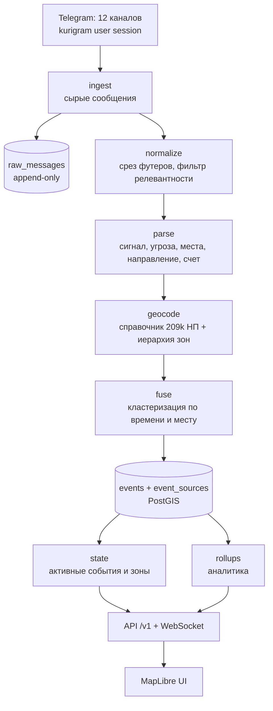

# Целевая архитектура

Статус: проектный документ. Описывает, что строим, а не что уже работает.
Составлен 27 июля 2026 года на основе разбора radar-map.ru, detector-aero.ru и
выборки 1 375 сообщений из 12 каналов папки «Радары».

Текущее состояние прототипа — в [PROJECT_KNOWLEDGE_BASE.md](PROJECT_KNOWLEDGE_BASE.md).

## 1. Позиционирование

Карта воздушной обстановки на основе публичных Telegram-лент. Отличие от
существующих решений — не в наборе функций, а в трех вещах:

1. **12 источников вместо 3.** Появляется кросс-источниковое подтверждение, а
   значит измеримая достоверность события, а не бинарный флаг.
2. **209 789 населенных пунктов в справочнике.** Разрешение топонимов до
   поселка, а не до района.
3. **Полная история с первого дня.** Аналитика по источникам, зонам и времени,
   а не 24-часовое окно.

Ограничение остается тем же, что у конкурентов: карта неофициальная,
справочная, не заменяет системы оповещения.

## 2. Конвейер



Каждый шаг идемпотентен и воспроизводим: из `raw_messages` можно перестроить
все производные таблицы после правки парсера. Это обязательное свойство —
парсер будет меняться постоянно.

## 3. Источники

Проверены 27.07.2026, суммарно 1 716 027 подписчиков.

| tier | Каналов | Свойства |
|---|---:|---|
| federal | 4 | Широкая география, телеграфный формат, шума почти нет |
| regional | 6 | В основном Кубань, низкий шум, обязательный футер |
| mixed | 2 | Оповещения вперемешку с новостями, нужен фильтр |

Полный список — в [`ingest/config.py`](../ingest/config.py).

География источников смещена: 8 из 12 каналов — Краснодарский край и Адыгея.
Юг покрыт глубоко, остальная страна — только четырьмя федеральными лентами.
Это надо либо принять как продуктовый фокус, либо расширять папку.

## 4. Форматы сообщений

Разбор 1 375 сообщений. Пять семейств:

### 4.1. Телеграфный блок (`lpr1_treugolnik`, `vrv_radar`, `lpr1_Krasnodar_alarm`)

```
Новороссийск
Анапа
Славянск На Кубани
Крымск
опасность по БПЛА
Краснодарский край
```

Список мест, затем вердикт, затем родительский регион. Одно сообщение может
содержать несколько таких блоков через пустую строку. Медиана 56–78 символов.

### 4.2. Однострочный (`radar_rvk`)

```
Азов, фиксация БПЛА
Ростов-на-Дону, работа ПВО по БПЛА
```

Медиана 44 символа, одна строка. Формат `<место>, <событие>`.

### 4.3. Локатор (`locatorru`) — самый структурированный

```
Кулешовка, Азовский район, Ростовская область - опасность по БПЛА.
Ещё 2 БПЛА от Новобелая, Кантемировский район, Воронежская область в сторону ...
```

Готовая цепочка `НП, район, область` — прямое попадание в нашу модель зон.
39% сообщений содержат направление, 22% — счет целей. Обязательный футер.

### 4.4. Официальная врезка РСЧС (`kubtrevoga93`, `radar_rschs_krd_adygea`, `locatorru`)

Перечисление десятков муниципальных образований одной строкой с датой.
Высокое доверие, широкий охват, редкая частота. Парсится отдельным правилом.

### 4.5. Брендированный с футером (`montkub`, `kubanoidici24838`, оба «Дозора»)

Тело как в 4.1 плюс обязательный футер подписки. У 6 каналов футер в 98–100%
сообщений. **Футер надо срезать до парсинга** — иначе название канала попадает
в токены и ломает разрешение топонимов.

### 4.6. Словарь событий

| Сигнал | Доля | | Угроза | Доля |
|---|---:|---|---|---:|
| опасность | 32% | | БПЛА | 70% |
| тревога | 17% | | ракета | 4% |
| фиксация | 12% | | Крымский мост | 3% |
| меры безопасности | 7% | | БЭК | 2% |
| внимание | 5% | | авиация | 1% |
| отбой | 5% | | аэропорт | 1% |
| работа ПВО | 4% | | FPV | 0,1% |
| сбитие | 2% | | КАБ/УАБ | 0,1% |
| пролет, сирена, взрыв | 4% | | | |

Отдельные классы, которые нельзя терять: **отбой** (5%) закрывает событие;
«погодные условия», «без паники» — явное опровержение ложной тревоги;
Крымский мост и аэропорты — инфраструктурные статусы, а не угрозы.

## 5. Слияние источников

72 текста из выборки встречаются в 2+ лентах, один — в 6. Но совпадение текста
без учета времени бесполезно: фраза «Краснодарский край, опасность по БПЛА»
повторяется месяцами. Настоящее подтверждение выглядит иначе — «Таманский
полуостров от Азовского моря, тревога по БПЛА» в 4 каналах с разбросом 44 с.

Поэтому ключ кластеризации — **не текст, а тройка**:

```
(набор зон, тип угрозы, временное окно)
```

Окно: 5 минут для совпадения зон, 15 минут при пересечении по родительской зоне.
Событие получает `confidence` из числа независимых источников с весом по
надежности источника; вес пересчитывается по историческим данным (§7).

Это то, чего нет ни у RadarMap, ни у Детектора АЭРО: у первого источник —
просто метка, у второго — счетчик подтверждений без весов и без публичной
истории надежности.

## 6. Модель данных

PostgreSQL + PostGIS. Сырое хранится вечно, производное пересобирается.

```sql
-- Неизменяемый вход. Единственный источник истины.
raw_messages(
  id, source_key, message_id, chat_id, posted_at, received_at,
  text, edit_of, views, raw jsonb,
  UNIQUE (source_key, message_id)
)

-- Справочник зон: регион -> район -> поселение -> НП.
zones(
  id text PRIMARY KEY,          -- собственный стабильный slug
  parent_id text REFERENCES zones,
  level text,                   -- region | district | settlement | place
  name_ru text, name_alt text[],
  geom geometry(MultiPolygon, 4326),
  centroid geometry(Point, 4326),
  oktmo text, geonames_id bigint, osm_id bigint
)

-- Событие после слияния.
events(
  id, first_seen_at, last_seen_at, resolved_at,
  status text,                  -- active | fading | resolved | retracted
  signal_type text,             -- danger | alarm | detection | pvo | allclear | ...
  threat_type text,             -- uav | fpv | rocket | kab | bek | aviation | unknown
  severity smallint,            -- 1..10
  confidence numeric,           -- 0..1, из числа и веса источников
  zone_id text REFERENCES zones,
  zone_path text[],             -- полная цепочка родителей
  lat, lon, accuracy_m int,
  direction_deg smallint, target_count smallint
)

-- Провенанс: какое сообщение какого источника дало это событие.
event_sources(event_id, raw_message_id, source_key, contributed_at, role)

-- Снимки состояния для истории и воспроизведения.
zone_state_snapshots(taken_at, zone_id, active_count, max_severity)
```

Ключевые отличия от конкурентов: `confidence` и `event_sources` — публичный
счетчик подтверждений при внутренней прослеживаемости до конкретного сообщения.
`zone_path` повторяет удачное решение Детектора АЭРО.

## 7. Аналитика

Считается по `raw_messages` + `event_sources`, обновляется роллапами.

**По источникам** — то, чего нет ни у кого:

- медиана задержки относительно первого сообщения о событии (кто быстрее);
- доля событий, подтвержденных двумя и более другими источниками;
- доля одиночных сообщений, так и не подтвержденных (прокси ложных срабатываний);
- доля сообщений, отброшенных фильтром релевантности;
- аптайм и частота публикаций по часам.

Эти метрики питают веса в §5: источник, который стабильно первый и стабильно
подтверждается, весит больше.

**По обстановке:**

- события и длительность по зонам, времени суток, дню недели;
- медианное время от первого сигнала до отбоя;
- тепловая карта плотности за произвольный период, не только за сутки;
- разбивка по типам угроз и динамика долей;
- воспроизведение любого исторического окна (у RadarMap — 24 часа, у нас — все).

## 8. API

Публичный срез отдельно от внутреннего — как `/api/pub/v1` у Детектора АЭРО.

```
GET  /api/v1/state                     активные события + счетчики зон
WS   /api/v1/stream                    push, без пейволла
GET  /api/v1/geo/regions.geojson       ~150 КБ, сразу
GET  /api/v1/geo/active?levels=...     геометрия только активных зон
GET  /api/v1/history?from=&to=         произвольное окно
GET  /api/v1/analytics/sources         метрики надежности источников
GET  /api/v1/analytics/zones?period=   плотность и длительности
```

Публично отдаются `confidence` и число подтвердивших источников, но **не** имена
каналов и не тексты первичных сообщений. Причина та же, что у Детектора АЭРО:
снижает риск злоупотреблений и давления на сами каналы.

## 9. Клиент

MapLibre GL вместо текущего OpenLayers: векторные тайлы, плавный zoom,
собственные стили по уровням зон.

Бюджет начальной загрузки — **не более 500 КБ** против нынешних 112 МБ.
Достигается схемой Детектора АЭРО: регионы сразу, детальная геометрия только
для активных зон по требованию.

Из текущего прототипа переносится поиск и справочник НП; массовая отрисовка
209 789 точек не переносится — гейзеттир живет на сервере и работает на
геокодинг, а не на рендер.

## 10. Что делать по порядку

1. Непрерывный `listen.py` с записью в `raw_messages` — начать копить историю
   сегодня, пока парсера еще нет.
2. Справочник зон: geoBoundaries + GeoNames + ОКТМО, собственные slug, иерархия.
3. Парсер по пяти форматам §4 с обязательным срезом футеров и фильтром
   релевантности для tier `mixed`.
4. Геокодер: разрешение топонимов в `zone_id` с учетом контекста региона.
5. Слияние и `confidence` (§5).
6. API + WebSocket.
7. Клиент на MapLibre.
8. Аналитика источников — как только накопится две недели истории.

Шаги 1 и 2 независимы и делаются параллельно. Шаг 1 срочный: каждый день без
сбора — потерянные данные, которые задним числом не восстановить.

## 11. Правовое

Не меняется относительно текущей базы знаний, но добавляется:

- тексты чужих каналов — чужой контент; хранение для обработки и публикация
  дословно это разные вещи, второе требует решения;
- публикация имен каналов-источников имеет последствия для самих каналов;
- собственные тайлы OSM требуют атрибуции ODbL (как это сделано у Детектора АЭРО);
- нужен ретеншн сырых сообщений и политика удаления.
